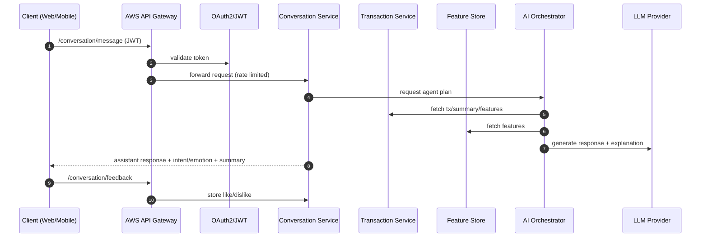

# Backend – Detailed Service Architecture (4.x)

This document describes the backend architecture for the Banking AI Dashboard / AI Consultant system, aligned with sections **4.1 → 4.10**.

---

## 4.1 Client Application

### 4.1.1 Function

- **AI Consultant Chatbot**
  - Suggested questions
  - Message feedback: like/dislike (for future finetune pipelines)
  - Conversation history context
- **Dashboard**
  - User profile + transaction history
  - Aggregations: statistics, trends, distributions
  - Insights + recommended products
  - Explainability: “why recommended”

### 4.1.2 Tech stack

- Web: **Next.js (React)** (current repo uses Vite+React; API contracts are compatible)
- Backlog: Mobile client

### 4.1.3 Traffic

- **300k users/day**
- **3–5 requests/session**
- Peak: **~30 RPS**

---

## 4.2 API Gateway

### 4.2.1 Function

- Authentication & Authorization
- Rate limiting / throttling
- Request routing and WAF rules

### 4.2.2 Tech stack

- **AWS API Gateway** (managed)
- **OAuth2 + JWT**
- (Recommended) **AWS Cognito** (or enterprise IdP) + JWKS validation

### 4.2.3 Traffic & Latency

- Non‑AI: **< 200ms** end‑to‑end
- AI: **~1–2s** (LLM calls dominate)

---

## 4.3 Conversation Service

### 4.3.1 Input

- User text (voice: backlog)
- Context: conversation history (turns, tool results, summaries)

### 4.3.2 Function

- **Context summarization** (rolling summary)
- **Intent detection** (loan, travel, saving, credit, insurance, …)
- **Emotion detection** (stress, concern, excitement, neutral)
- **Feedback collection** (like/dislike + optional rationale)

### 4.3.3 Tech stack

- **Python + FastAPI**
- Summarization LLM: lightweight model (OpenAI or later AWS Bedrock)
- LLM provider: OpenAI API (current), Alibaba/AWS LLM (backlog)

### 4.3.4 Traffic

- AI latency target: **1–2s** per call
- Volume: **~300k requests/day**

### API Contract (proposed)

- `POST /v1/conversation/message`
  - Input: user text + conversationId + last N turns or summary token
  - Output: assistant response + updated summary + intent/emotion + safety flags
- `POST /v1/conversation/feedback`
  - Input: messageId + reaction(like/dislike) + optional reason
  - Output: ack + storage id

---

## 4.4 Transaction Service

### 4.4.1 Function

- Ingest transactions from core banking
- Normalize/enrich:
  - category mapping (MCC), channel, installment info (if present)
- Serve user transaction APIs for dashboard and feature engine

### 4.4.2 Tech stack

- Streaming ingestion: **AWS MSK (Kafka)**
- Storage: **AWS RDS (PostgreSQL)** + **Data Lake (S3)**
- For local mock: FAR‑Trans CSV → DuckDB/SQLite

### API Contract (proposed)

- `GET /v1/users/{id}/transactions?start=YYYY-MM-DD&end=...`
- `GET /v1/users/{id}/summary?window=90d`

---

## 4.5 Feature Engine & Feature Store

### 4.5.1 Function (examples)

- Category spend (3m)
- Frequency, Recency
- Trend (shopping up/down)
- Installment ratio (if data available)

### 4.5.2 Tech stack

- Batch + streaming processing: **AWS Flink**
- Feature store: **Feast** (backlog: SageMaker Feature Store)

### 4.5.3 Scale

- Feature refresh: daily + interval (24h / 12h / 4h)
- Flow: ingest → normalize → compute → store → serve

---

## 4.6 AI Agent Orchestrator (Core knowledge)

### 4.6.1 Function

- Orchestrate agents/tools:
  - fetch transactions/features
  - behavior detection
  - insight explanation
  - product ranking

### 4.6.2 Tech stack

- LangChain (or similar)
- LLM: GPT‑4 class (backlog: Bedrock / Alibaba)
- Vector DB: AWS native vector DB / OpenSearch vector

### 4.6.3 AI Load

- Sessions/day: 200k
- Avg turns: 5
- LLM calls: ~1M/day

---

## 4.7 Behaviour Detection Agent

### 4.7.1 Function

- Detect personal patterns:
  - travel-heavy/shopping-heavy
  - high installment usage
  - stable income/outcome patterns (rent)

### 4.7.2 Tech stack

- Hybrid: rule‑based + ML
- ML model: Gradient boosting

### 4.7.3 Latency

- Target: **~300ms** per request (non‑LLM)

---

## 4.8 Explainable Insight Agent

### 4.8.1 Function

- Convert numeric signals → user‑friendly language
- Provide “why” with references to feature values

### 4.8.2 Tech stack

- Prompt templates + LLM

---

## 4.9 Product Rec Agent

### 4.9.1 Function

- Recommend best products given behavior + eligibility:
  - travel credit card
  - health insurance
  - shopping card

### 4.9.2 Tech stack

- Rule engine + ranking model

### 4.9.3 Output

- Ranked list with thresholds + explanation

---

## 4.10 Security & Compliance Agent

### Requirements

- Encryption in transit (TLS) + at rest (KMS)
- Prompt/output filtering
- No auto financial decision by AI
  - AI outputs are recommendations
  - Final decisions require supervisor / policy engine

### Implementation notes (recommended)

- Central policy checks in gateway or a dedicated policy service:
  - PII redaction
  - prompt injection heuristics
  - output safety classification
- Audit logging (immutable): request id, user id hash, prompts, tool calls, model id, latency

---

## End‑to‑End Flow (simplified)

